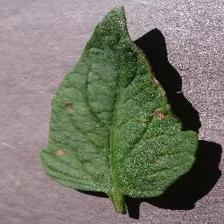

# 🌿 Plant Disease Classifier

> 🔎 A PyTorch-powered image classifier that diagnoses plant diseases from leaf images, built for real-time deployment.

A prototype for an image-based crop monitoring system that detects plant leaf diseases using deep learning. Built with PyTorch and ResNet18, this project simulates a scalable diagnostic tool that could be integrated into mobile apps, IoT platforms, or farm management systems.

---

## 📌 Problem

Plant diseases are a major threat to crop yield and food security. Early detection is essential—but visual identification can be inconsistent, especially for novice growers or in remote locations without agronomists.

This project demonstrates how machine learning can support automated, image-based diagnosis at scale.

---

## 🚀 Project Highlights

- ✅ **Transfer Learning** with ResNet18 on the [PlantVillage dataset](https://www.kaggle.com/datasets/emmarex/plantdisease)
- 📉 **Live Training Curves** using matplotlib in Jupyter
- 📊 **Confusion Matrix & Misclassification Analysis**
- 🧠 Insight: Frequent misclassification between *Target Spot* and *Spider Mites*—a critical diagnostic distinction
- ⚙️ Built for **deployment** via FastAPI or Streamlit (coming soon)

---

## 🖼 Sample Prediction

| Input Image | Predicted | Confidence |
|-------------|-----------|------------|
|  | `Tomato___Early_blight` | 93.4% |

> _(Sample image will render when this file is hosted on GitHub)_

---

## 🧰 Tech Stack

- `Python 3.10`
- `PyTorch` (ResNet18)
- `Torchvision`, `Pillow`, `Scikit-learn`
- `matplotlib` (live training curves)
- [Optional] Apple M1 GPU via Metal backend (MPS)
- [Planned] `FastAPI` or `Streamlit` frontend

---

## 📂 Repo Structure
```
plant-disease-classifier/  
├── data_processed/        # Preprocessed train/val image folders  
├── models/                # Saved PyTorch model weights  
├── notebooks/  
│   └── train.ipynb  
├── prepare_data.py        # Image resizing and preprocessing
├── README.md
└── pyproject.toml
```
---

## ▶️ Try It Yourself
Run the training notebook.  
[](https://colab.research.google.com/github/jlmontie/plant-disease-classifier/blob/main/notebooks/train_final.ipynb)

Use the web app to make a prediction.
[](https://plantdiseaseclassifier-brrwvxbf7n8c2htzqo3kuf.streamlit.app/)

---

## 🔮 What I'd Build Next

- Convert model to `ONNX` or `TorchScript` for mobile use
- Edge deployment via Raspberry Pi + camera
- Real-time leaf scan via phone (Flutter or React Native app)
- Model compression + pruning for low-power inference

---

## 🙋‍♂️ About Me

I'm a data scientist and engineer with a background in diagnostics, bioinformatics, and AI deployment. I build real-world systems that turn data into insight—from ML models to dashboards to end-to-end pipelines.

[Connect with me on LinkedIn](https://www.linkedin.com/in/montgomeryjesse/)